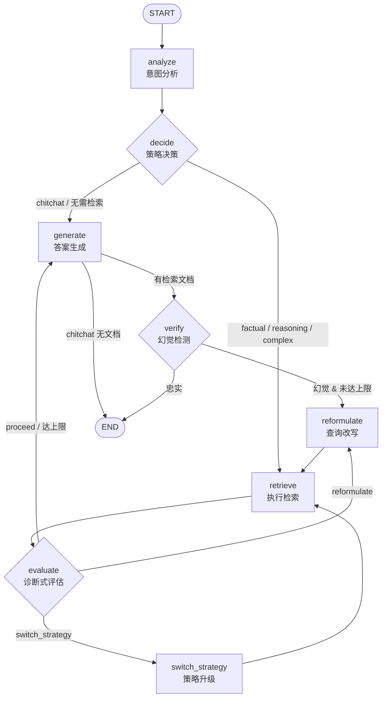

# RAGForge

> Agentic RAG —— LangGraph 状态机驱动的自适应检索增强生成系统

RAGForge 是一个**会自主决策的 RAG Agent**：基于 LangGraph 8 节点状态机分析查询意图，按需选择检索策略（向量 / BM25 / 混合 RRF / 重排序），对检索结果做**诊断式评估**（区分“召回不足”还是“结果无关”），不达标时自动改写查询或切换策略并重新检索，最后生成答案并做**幻觉检测**——一旦发现答案未忠实于上下文，会触发新一轮改写检索，直到通过验证或达到迭代上限。

## 架构

8 节点 LangGraph 状态机，含 4 条条件边和 2 个自愈循环（reformulate / switch_strategy）：



**节点说明**：

| 节点 | LLM | 职责 |
|------|:---:|------|
| analyze | ✅ | 判断 query_type（factual/reasoning/chitchat/complex）+ needs_retrieval |
| decide | ❌ | 纯规则路由：chitchat→none, factual→vector, reasoning→bm25, complex→hybrid |
| retrieve | ❌ | 按 strategy 调用对应检索器；iteration_count 唯一递增点（每轮真实检索 +1） |
| evaluate | ✅ | **诊断式**：输出 failure_mode（low_recall/irrelevant/sufficient）+ suggested_action；分数规则仅对 vector 策略生效（详见 ADR-006） |
| reformulate | ✅ | 按 failure_mode 选择改写策略；改写无效（LLM 失败或改写 == 原查询）时路由直接生成，跳过无效重检索 |
| switch_strategy | ❌ | 纯规则策略升级：vector → bm25 → hybrid；已是 hybrid 时路由短路直达生成 |
| generate | ✅ | 基于检索上下文生成回答（LLM 失败时降级兜底） |
| verify | ✅ | 幻觉检测；确认幻觉时递增 verify_failures 并触发 reformulate 重试 |

**安全机制**：双预算防死循环——`iteration_count`（检索总次数上限，retrieve 唯一递增）与 `verify_failures`（幻觉重试上限，verify 唯一递增）均默认 3；外加 LangGraph `recursion_limit`（第二道防线）。

## 技术栈

| 层 | 技术 | 说明 |
|----|------|------|
| 语言 | Python ≥ 3.11 | 类型注解、TypedDict 状态 |
| 包管理 | uv | 极速依赖解析 |
| Agent 框架 | LangGraph ≥ 1.2.4 | 8 节点状态机、条件边、astream_events |
| LLM 编排 | LangChain ≥ 1.3.4 | LCEL chain、ChatPromptTemplate |
| LLM | DeepSeek（OpenAI 兼容） | deepseek-flash，60s 超时 + tenacity 瞬时故障重试 |
| 向量检索 | ChromaDB + langchain-chroma | 持久化、cosine relevance、确定性 ID + 指纹校验 |
| 关键词检索 | rank-bm25 | BM25Okapi，jieba/regex 双分词（小写归一） |
| 混合检索 | RRF（自实现） | `score = Σ 1/(k+rank)`，top-2k 候选融合 |
| 重排序 | sentence-transformers | CrossEncoder bge-reranker-v2-m3，优雅降级（600s 冷却重试） |
| Embedding | langchain-huggingface | all-MiniLM-L6-v2（384 维） |
| 分块 | tiktoken + MarkdownHeaderTextSplitter | token 预算切分（220/30）+ 标题上下文注入 |
| API | FastAPI + sse-starlette | /chat + /chat/stream（SSE 逐 token） |
| 日志 | loguru | 双输出（控制台 + 文件） |
| 配置 | pydantic-settings | 类型安全 + .env |
| 评估 | rich | 终端对比表 + JSON 报告 |

## 快速开始

### 1. 安装依赖

```bash
uv sync
```

### 2. 配置环境变量

```bash
cp .env.example .env
# 编辑 .env，填入 DEEPSEEK_API_KEY
```

### 3. 运行

```bash
# 启动 API 服务（默认模式，含 /docs 交互文档）
uv run python -m src.main

# 交互式 CLI 模式
uv run python -m src.main --cli

# 自定义端口
uv run python -m src.main --port 9000
```

### 4. 调用 API

```bash
# 健康检查
curl http://localhost:8000/health

# 同步对话
curl -X POST http://localhost:8000/chat \
  -H "Content-Type: application/json" \
  -d '{"query": "Python 装饰器怎么用？"}'

# SSE 流式对话（逐 token 推送）
curl -N -X POST http://localhost:8000/chat/stream \
  -H "Content-Type: application/json" \
  -d '{"query": "什么是过拟合？"}'
```

### 5. 运行评估

```bash
uv run python scripts/eval.py                  # 完整评估（4 套模式，需 API key）
uv run python scripts/eval.py --retrieval-only # 离线检索评估（不调 LLM，免 API）
uv run python scripts/eval.py --rebuild        # 评估前清库重建索引
# 输出：终端对比表 + reports/eval_report.json
```

## 设计亮点

### 1. 诊断式评估（区别于普通打分）

`evaluate` 节点不只输出"相关/不相关"，而是**诊断失败原因**：
- `low_recall`：召回不足（结果太少或向量分数低）→ 建议切换策略（向量→BM25→混合）
- `irrelevant`：结果无关（关键词不匹配）→ 建议改写查询（specify 限定）
- `sufficient`：充足 → 直接生成

不同 failure_mode 触发不同的自愈动作，而非盲目重试。

### 2. 策略自动升级

`switch_strategy` 节点实现单向策略升级链：`vector → bm25 → hybrid`。当向量检索召回不足时自动补充关键词检索，混合检索是兜底方案。

### 3. RRF 混合检索（无需调参）

使用 Reciprocal Rank Fusion 融合两路检索结果：
```
score(d) = Σ_i  1 / (rrf_k + rank_i(d))
```
无需归一化两路不同尺度的分数（向量 relevance ∈ [0,1]，BM25 无界），直接用排名融合，鲁棒且零调参。

### 4. 幻觉检测闭环

`verify` 节点判断答案是否忠实于检索上下文。一旦检出幻觉，触发 `reformulate` → `retrieve` 循环重新生成，直到通过验证或达到 `max_iterations`。

### 5. SSE 真正的逐 token 流

`/chat/stream` 使用 `graph.astream_events(version="v2")`（而非 `astream`），捕获 `on_chat_model_stream` 事件实现真正的 LLM 逐 token 推送，同时推送 8 节点的执行进度事件。

### 6. 全链路优雅降级

- Reranker 模型不可用 → 自动跳过，退化为纯 RRF 混合（600s 冷却后可重试加载）
- DeepSeek 结构化输出失败 → 带纠错提示重试 1 次，仍失败则节点降级到规则默认值
- LLM 生成彻底失败 → generate 节点返回降级文案，状态机总能产出答案
- LLM 调用 → tenacity 重试（仅连接/超时/限流/5xx 等瞬时故障，3 次指数退避；401/400 等永久错误直接抛出）

## 项目结构

```
RAGForge/
├── src/
│   ├── config.py              # pydantic-settings 配置单例
│   ├── main.py                # 精简入口（58 行）+ 向后兼容 re-export
│   ├── pipeline.py            # Agent 管道构建与执行（从 main.py 拆分）
│   ├── cli.py                 # CLI / Server 启动模式（从 main.py 拆分）
│   ├── ingestion/             # Task 2：文档处理层
│   │   ├── parser.py          #   DocumentParser（MD/PDF 策略模式）
│   │   ├── chunker.py         #   TextChunker（token 预算切分 + 标题上下文）
│   │   └── embedder.py        #   EmbeddingService（线程安全单例）
│   ├── retrieval/             # Task 3/6：检索层
│   │   ├── vector_store.py    #   VectorStore（ChromaDB）
│   │   ├── bm25.py            #   BM25Retriever（jieba/regex 分词）
│   │   ├── hybrid.py          #   HybridRetriever（RRF 融合）
│   │   └── reranker.py        #   Reranker（CrossEncoder 优雅降级）
│   ├── generation/            # Task 4/5：生成层
│   │   ├── llm_client.py      #   LLMClient（tenacity 重试 + 结构化输出）
│   │   ├── prompts.py         #   PromptManager（5 个 Prompt 模板）
│   │   └── schemas.py         #   结构化输出 Pydantic schema
│   ├── agent/                 # Task 5：Agent 决策层
│   │   ├── state.py           #   AgentState（TypedDict）+ initial_state
│   │   ├── graph.py           #   LangGraph 状态机组装（8 节点 + 条件边）
│   │   └── nodes/             #   8 个节点实现
│   │       ├── analyze.py / decide.py
│   │       ├── retrieve.py / evaluate.py
│   │       ├── reformulate.py / switch_strategy.py
│   │       └── generate.py / verify.py
│   ├── api/                   # Task 7：FastAPI + SSE
│   │   ├── app.py             #   应用工厂 + lifespan 启动预热 + CORS
│   │   ├── routes.py          #   /health /chat(async) /chat/stream(SSE)
│   │   ├── schemas.py         #   请求/响应 Pydantic 模型
│   │   └── dependencies.py    #   graph 注入（lifespan 预热，未就绪 503）
│   └── utils/
│       ├── logger.py          #   loguru 双输出（多 worker 安全）
│       └── metrics.py         #   MetricsCollector（请求级实例 + ContextVar 注入）
├── tests/
│   ├── conftest.py            #   共享 fixtures（临时 Chroma 目录 / Fake 工厂）
│   ├── fakes.py               #   FakeLLM / FakeRetriever（无网络测试组件）
│   ├── test_ingestion.py      #   Ingestion 单元测试（离线）
│   ├── test_retrieval.py      #   检索层测试（离线，含索引一致性回归）
│   ├── test_agent.py          #   Agent 状态机测试（全 mock，离线）
│   ├── test_stage1.py         #   结构与管道构建测试（离线）
│   ├── test_integration.py    #   集成测试（真实 API，RUN_INTEGRATION=1 门控）
│   └── eval_dataset.json      #   评估数据集（15 QA）
├── scripts/
│   └── eval.py                # Task 8 评估脚本（4 套对比 + 增量模式）
├── data/sample/               # 知识库（python_basics.md + machine_learning_faq.md）
├── docs/
│   ├── adr/                   # 架构决策记录（5 篇 ADR）
│   ├── modules/               # 模块设计文档（5 篇）
│   ├── learning/              # 学习笔记（8 篇，按 Task 拆分）
│   └── planning/              # 规划文档（.gitignore 排除，不提交）
├── pyproject.toml
└── .env.example
```

## 评估指标对比

运行 `uv run python scripts/eval.py --rebuild` 生成（数据集：45 题 = 30 可答 + 10 语料外不可答 + 5 寒暄；语料 8 文档 49 chunks；模型 deepseek-flash）：

| 配置 | Recall@5 | MRR@5 | 幻觉率(可答) | 拒答准确率 | P99 延迟 | 平均 Token |
|------|:----------:|:-----:|:-------:|:-------:|:-------:|:---------:|
| baseline（线性 RAG） | 73.3% | 61.7% | 3.3% | 100% ✅ | 12291ms | 1138 |
| + Agent（状态机） | 96.7% | 84.4% | **0.0%** ✅ | 100% ✅ | 32900ms | 1085 |
| + Hybrid（RRF 融合） | **100.0%** ✅ | 95.8% | **0.0%** ✅ | 100% ✅ | 33411ms | 988 |
| + Reranker（重排序） | 96.7% | **95.0%** | **0.0%** ✅ | 100% ✅ | 27645ms | **947** |

**目标门槛**：召回率 ≥ 90%、MRR ≥ 70%、幻觉率 < 5%、拒答准确率 ≥ 80%。

> **评估口径**（2026-09-12 基线，0 错误 / 0 未验证，总消耗 91.6 万 tokens）：
> 题型分层（可答 / 语料外不可答 / 寒暄）；检索判定为 chunk 级（来源文件 +
> gold 关键词双条件）；忠实度与拒答行为由 LLM 统一裁决；不可答题编造率全部
> 为 0.0%（详见 JSON 报告）。P99 远超 2s 门槛的原因是 LLM 生成延迟与多轮
> 调用长尾，属 API 侧延迟而非检索/编排开销；生产环境以 `/chat/stream`
> 流式输出改善体感延迟。完整明细见 `reports/eval_report.json`（含索引指纹，可复现）。

### 结果分析

**检索层区分度（本轮改造的核心目标）**：指标不再"人人 100%"——
- **vector-only baseline 只有 73.3%**：all-MiniLM 是英文向量化模型，中文语料召回乏力（8 题 chunk 级未命中）；
- **Agent 状态机把 73.3% 拉到 96.7%**：evaluate 诊断 low_recall → switch_strategy 切到 BM25 的自愈闭环，直接贡献 +23.4 个百分点——这是状态机价值的最直接证据；
- **hybrid 拿到 100%**：RRF 融合两路互补；
- **MRR 上 reranker 现身**：离线对照中 hybrid 粗排 MRR 仅 76.3%，reranker 精排拉到 96.7%（MRR 是排序质量指标，reranker 的价值体现在这里而非召回）；
- 真实失败案例：reranker 模式丢了「令牌桶限流」一题——CrossEncoder 精排把 gold chunk 挤出 top-5（hybrid 100% 命中），说明精排模型与标注的判断存在不一致，这正是评估体系该暴露的问题。

**幻觉率**：可答题 30 题中 baseline 3.3%（1 题不忠实，恰是它检索未命中的那题——检索失败导致回答偏离，逻辑自洽），三种 Agent 模式全部 **0.0%**：verify → reformulate 自愈闭环实测有效。

**拒答准确率（新指标）**：10 道语料外不可答题（K8s、Rust、React、GraphQL、版本号等，含与语料主题相近的近似干扰题）全部被诚实拒答，编造率 0%——deepseek-flash 配合拒答友好的 QA_PROMPT 表现良好。该指标在换用更激进的模型或提示时才有区分度，现已就位。

**Token 效率**：Agent 模式 947~1085 token，均优于 baseline 的 1138。

**延迟**：Agent 模式 P50 约 15s（多轮 LLM 调用），P99 长尾 27~33s；较旧基线（Agent P99 47.5s）大幅下降。优化方向：调低 `max_iterations`、缓存、流式输出。

## License

MIT
