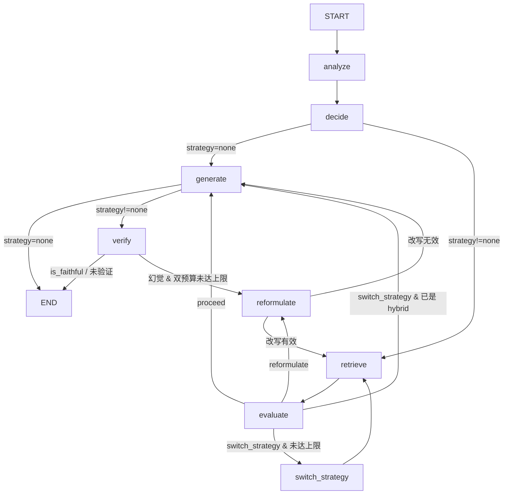
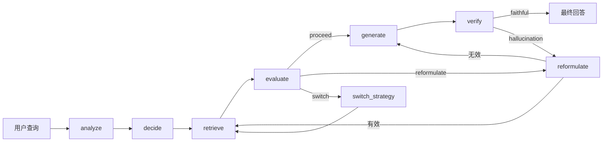

# Agent 决策层（Agent）

## 模块职责

Agent 决策层基于 LangGraph 构建 8 节点状态机，自主决策检索策略，包含诊断式评估（`failure_mode` + `suggested_action` 驱动策略切换/查询改写）和幻觉检测闭环。

## 状态设计

### AgentState

全局状态容器，`TypedDict(total=False)` 允许节点只更新部分字段：

```python
class AgentState(TypedDict, total=False):
    query: str                                    # 用户输入
    query_type: QueryType                         # factual | reasoning | chitchat | complex
    needs_retrieval: bool                         # 是否需要检索
    retrieval_strategy: RetrievalStrategy          # vector | bm25 | hybrid | none
    documents: list[Document]                     # 检索结果
    retrieval_scores: list[float]                 # 检索分数
    failure_mode: FailureMode                     # low_recall | irrelevant | sufficient
    suggested_action: SuggestedAction              # reformulate | switch_strategy | proceed
    diagnosis_reason: str                         # 诊断原因
    reformulated_query: str                       # 改写后的查询
    rewrite_effective: bool                       # 改写是否有效（False → 路由直接生成）
    answer: str                                   # 生成的回答
    is_faithful: bool | None                      # 幻觉检测结果（None = 校验失败未验证）
    verification_reason: str                      # 校验原因
    iteration_count: int                          # 检索总次数（retrieve 唯一递增）
    verify_failures: int                          # 幻觉重试次数（verify 唯一递增）
    max_iterations: int                           # 上限（默认 3，两个计数共用）
    messages: Annotated[list[str], add]           # 决策轨迹日志（自动追加）
```

**关键字段**：
- `failure_mode` + `suggested_action`：诊断式评估核心，驱动策略切换/查询改写
- `iteration_count` / `verify_failures`：双预算防死循环（见「安全机制」）
- `is_faithful: None`：LLM 校验失败的「未验证」状态，路由层视为通过（不因验证器故障误触发重检索），评估层单独归类
- `messages: Annotated[list, add]`：LangGraph 自动追加，记录完整决策轨迹

### 初始状态工厂

```python
def initial_state(query: str, max_iterations: int = 3) -> AgentState:
    """构造初始状态：iteration_count=0、verify_failures=0、max_iterations、空 messages。"""
```

## 状态机拓扑



## 节点说明

| 节点 | 需要 LLM | 职责 |
|------|----------|------|
| `analyze` | 是 | 分析查询意图，判断 `query_type` 和 `needs_retrieval`，LLM 失败时降级为 factual+需检索 |
| `decide` | 否 | 纯规则决策：chitchat→none，factual→vector，reasoning→bm25，complex→hybrid |
| `retrieve` | 否 | 按 `retrieval_strategy` 调用对应检索器，优先使用 `reformulated_query`；`iteration_count` 唯一递增点（每轮真实检索 +1） |
| `evaluate` | 是 | 诊断检索质量：规则层（空结果硬规则；绝对分数阈值仅对 vector 策略生效，见 ADR-006）+ LLM 层（语义判断，不注入分数），输出 `failure_mode` + `suggested_action` |
| `reformulate` | 是 | 根据 `failure_mode` 改写查询；输出 `rewrite_effective`（LLM 失败或改写 == 原查询时为 False） |
| `switch_strategy` | 否 | 纯规则升级策略：vector→bm25→hybrid，单向升级不回退 |
| `generate` | 是 | 基于检索上下文调用 LLM 生成回答；LLM 失败时返回降级文案（状态机总能产出答案） |
| `verify` | 是 | 幻觉检测；确认幻觉时 `verify_failures += 1`（唯一递增点），校验失败标记 `is_faithful=None` |

## 条件边（路由函数）

### route_after_decide

```python
def route_after_decide(state: AgentState) -> str:
    """strategy=none → generate（跳过检索），否则 → retrieve。"""
```

### route_after_evaluate

```python
def route_after_evaluate(state: AgentState) -> str:
    """三路分支 + 两处短路：
    - proceed → generate
    - switch_strategy 且已是 hybrid → generate（切换无效，避免空转）
    - switch_strategy（其余策略）→ switch_strategy
    - reformulate → reformulate
    - iteration_count >= max_iterations → 强制 generate（防死循环）"""
```

### route_after_generate

```python
def route_after_generate(state: AgentState) -> str:
    """strategy=none（chitchat）→ END（跳过 verify），其他 → verify。"""
```

### route_after_reformulate

```python
def route_after_reformulate(state: AgentState) -> str:
    """改写有效（rewrite_effective=True）→ retrieve；
    改写无效（LLM 失败或改写结果与原查询相同）→ generate（跳过注定重复检索的循环）。"""
```

### route_after_verify

```python
def route_after_verify(state: AgentState) -> str:
    """is_faithful=True/None → END（未验证不触发循环）；
    幻觉且 verify_failures 或 iteration_count 达上限 → END；
    否则 → reformulate。"""
```

## 安全机制

**双预算 + recursion_limit 三重保护防死循环**：

| 机制 | 配置 | 说明 |
|------|------|------|
| `iteration_count` | ≤ 3（状态级） | 检索总次数上限：`evaluate` 和 `verify` 路由检查，达上限强制走向 `generate`/`END` |
| `verify_failures` | ≤ 3（状态级） | 幻觉重试上限：覆盖「改写无效短路」后 `verify→reformulate→generate` 不经过 retrieve 的循环 |
| `recursion_limit` | 50（调用级） | LangGraph 编译后图的执行上限，第二道防线 |

**计数递增点（各唯一）**：
- `retrieve_node`：每轮真实检索时 `iteration_count += 1`（含首次）
- `verify_node`：确认幻觉时 `verify_failures += 1`

## 依赖注入

`build_agent_graph()` 通过 `functools.partial` 将外部依赖注入到各节点函数：

```python
def build_agent_graph(
    vector_store: VectorStore,
    bm25_retriever: BM25Retriever,
    llm_client: LLMClient,
    prompt_manager: PromptManager,
    hybrid_retriever=None,  # 可选，Task 6 注入
    reranker=None,          # 可选，Task 6 注入
):
    graph.add_node("analyze", partial(analyze_node, llm=llm_client, prompts=prompt_manager))
    graph.add_node("decide", decide_node)  # 纯规则，无依赖
    graph.add_node("retrieve", partial(retrieve_node,
        vector_store=vector_store, bm25=bm25_retriever,
        hybrid_retriever=hybrid_retriever, reranker=reranker))
    # ... 其他节点
```

**节点统一签名**：`node(state: AgentState, *, llm, prompts, **deps) -> dict`，返回部分状态更新。

## 数据流图


