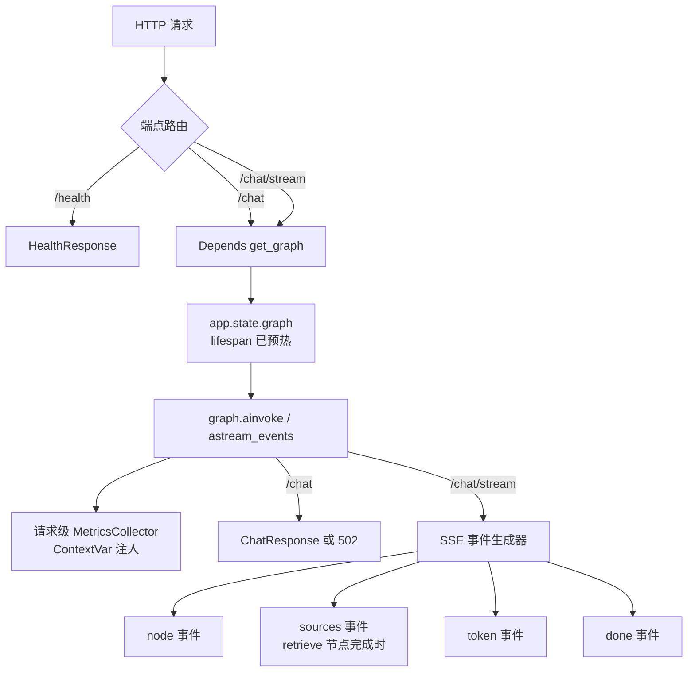

# API 服务层（API Service Layer）

## 1. 模块定位与设计动机

API 服务层（`src/api/`）是 RAGForge 的**唯一对外边界**，将 LangGraph 8 节点状态机封装为 HTTP 接口。其核心设计动机：

> Agent 状态机的构建成本极高（解析文档 → 切分 → 嵌入 → 组装图），必须在**启动阶段（lifespan）预热构建并 fail-fast**，而非在首个请求内惰性构建；同时需要同时支持同步请求和 SSE 流式两种交互模式。

这决定了模块的四个架构支柱：**应用工厂**、**lifespan 启动预热**、**请求级指标隔离**、**SSE 事件模型**。

## 2. 架构与类设计

### 2.1 应用工厂 — create_app()

```python
def create_app() -> FastAPI
def get_app() -> FastAPI        # 模块级单例入口
def _configure_langsmith() -> None  # 环境变量零代码追踪
def lifespan(application) -> AsyncIterator  # 启动预热 + fail-fast
```

`create_app()` 构建 FastAPI 实例：注册路由 + CORS 中间件（白名单来自 `api_cors_origins` 配置）+ lifespan。LangSmith 追踪通过 `_configure_langsmith()` 设置环境变量（`LANGSMITH_TRACING`、`LANGSMITH_API_KEY`、`LANGSMITH_PROJECT`），LangChain 运行时自动读取——零代码侵入。`get_app()` 提供模块级单例，供 uvicorn `--factory` 引用。

**lifespan 启动预热**：启动时先校验 `DEEPSEEK_API_KEY` 非空（缺失直接终止启动），再构建完整 Agent 管道存入 `app.state.graph`，并置 `app.state.ready = True`。构建失败（如数据目录缺失、embedding 模型加载失败）会让**启动进程直接失败**，而不是让服务"活着"但每个请求都重复昂贵且注定失败的构建。

### 2.2 路由 — 3 端点

```python
GET  /health                         → HealthResponse
POST /chat         (async)           → ChatResponse
POST /chat/stream  (async + SSE)     → EventSourceResponse
```

| 端点 | 调用方式 | 用途 |
|------|----------|------|
| `/health` | 同步 | 健康检查，`status=ok`（就绪）/ `starting`（构建中）+ `version` |
| `/chat` | `graph.ainvoke()` | 完整执行状态机后返回结构化响应（answer + sources + trace + metrics）；执行失败返回结构化 502 |
| `/chat/stream` | `graph.astream_events(v2)` | SSE 流式，逐 token + 节点事件推送 |

**关键设计取舍**：`/chat` 使用 `ainvoke` 而非 `invoke`，避免阻塞 FastAPI 的事件循环。`/chat/stream` 使用 `astream_events(version="v2")` 而非 `astream()`——后者只返回节点级状态快照，无法捕获 `on_chat_model_stream` 事件，无法实现真正的逐 token 推送。

**请求校验**：`query` 限长 1~4000 字符且拒绝纯空白；`session_id` 缺省时生成完整 uuid4。

### 2.3 依赖注入 — get_graph()

```python
def get_graph(request: Request) -> CompiledGraph  # FastAPI Depends 注入
```

graph 由 **lifespan 启动时构建**并存放在 `app.state.graph`，`get_graph` 直接读取；若 lifespan 尚未完成（极端情况），返回 503 提示「服务尚未就绪」。相比惰性初始化，启动预热把首请求延迟从分钟级降为 0，且构建失败在启动阶段即暴露。

### 2.4 请求级指标注入 — MetricsCollector + ContextVar

`MetricsCollector` 是普通实例类（**非全局单例**）。每个请求创建独立实例，经 `set_current_collector()` 写入 ContextVar：

```python
metrics = MetricsCollector()
context_token = set_current_collector(metrics)
try:
    final_state = await graph.ainvoke(...)
finally:
    reset_current_collector(context_token)
```

LangGraph 在 executor 线程中以 `copy_context()` 执行同步节点，因此节点内 `get_current_collector()`（`llm_client` 记录 token、`retrieve` 节点记录检索延迟）取到的正是本请求实例——**并发请求的指标互不污染**。eval/CLI 等单线程场景使用进程级默认实例。

### 2.5 Pydantic Schemas — 接口合约

```python
class ChatRequest(BaseModel):       # query(1~4000 字符, strip) + session_id
class ChatResponse(BaseModel):      # answer + sources + agent_trace + metrics + session_id
class SourceDoc(BaseModel):         # content + source + score
class ResponseMetrics(BaseModel):   # retrieval_latency_ms + e2e_latency_ms + token_usage
class HealthResponse(BaseModel):    # status(ok|starting) + version
```

`ChatResponse.agent_trace` 承载 Agent 状态机 `messages` 决策轨迹日志（由 `Annotated[list[str], add]` 在各节点自动追加），供前端展示 Agent 思考过程。

## 3. SSE 事件模型

`/chat/stream` 端点通过 `graph.astream_events(version="v2")` 捕获 5 种事件：

| 事件类型 | 触发条件 | data 格式 | 说明 |
|----------|----------|-----------|------|
| `node` | `on_chain_end` 且 name ∈ 8 个业务节点 | `{"node": "analyze"}` | Agent 节点执行完成 |
| `sources` | `retrieve` 节点完成后、生成开始前（推送一次） | `[SourceDoc...]` | 检索来源文档（含相关性分数） |
| `token` | `on_chat_model_stream` | `{"text": "<token>"}` | LLM 逐 token 生成（仅 generate 节点） |
| `done` | 流结束 | `{"session_id": "...", "e2e_latency_ms": ...}` | 流终止信号 |
| `error` | 生成器内部异常 | `{"message": "..."}` | 执行失败（流中断时） |

**时序契约**：`node(retrieve)` → `sources` → `node(evaluate)` → `token*` → `done`。来源文档在生成开始前推送，前端可先渲染引用来源。

**final_state 捕获**：任一含 `answer` 键的 `on_chain_end` 输出均被采纳（根图最后完成，覆盖节点输出），未捕获到时记录 warning——不再硬编码根链路名，避免 LangGraph 版本升级后 sources 静默消失。chitchat 等无检索场景的 sources 兜底从 final_state 提取。

---

## 4. 数据流



---

## 5. 设计模式

| 模式 | 体现 | 设计意图 |
|------|------|----------|
| **应用工厂** | `create_app()` 构建 FastAPI 实例 | 应用构建可测试、可重复，与运行时解耦 |
| **依赖注入** | `Depends(get_graph)` | 路由函数不直接构造依赖，由框架管理生命周期 |
| **启动预热（lifespan）** | FastAPI lifespan 构建管道 + fail-fast | 重型构建失败在启动阶段暴露，首请求零构建延迟 |
| **ContextVar 注入** | `set_current_collector` + LangGraph `copy_context` | 请求级指标隔离，并发请求互不污染 |
| **观察者（SSE）** | `astream_events` 异步事件迭代 | 将状态机的内部执行过程转化为事件流，前端可实时消费 |

---

## 6. 错误处理

```
/chat 端点 ────── graph.ainvoke 异常 → HTTPException 502（结构化 detail，与流式错误契约对齐）
                   │
/chat/stream ──── event_generator 内部异常 → catch + yield {"event":"error"} → SSE 优雅终止
                   │
get_graph ──────── lifespan 未完成 → 503 服务尚未就绪
                   │
lifespan ────────── key 缺失 / 管道构建失败 → 启动进程直接失败（fail-fast）
```

`/chat` 的执行异常被捕获后转为结构化 502（detail 含异常类型与信息），不再返回裸 500。SSE 端点的异常被 `except Exception` 捕获后转化为 `error` 事件推送给客户端，生成器自然终止，连接正常关闭——不会导致连接挂起。

---

## 7. 配置项

| 配置键 | 默认值 | 说明 |
|--------|--------|------|
| `api_host` | `127.0.0.1` | FastAPI 监听地址（默认仅本机；对外部署显式改为 `0.0.0.0` 并配合鉴权） |
| `api_port` | `8000` | FastAPI 监听端口（1~65535） |
| `api_cors_origins` | `["*"]` | CORS 白名单（JSON 数组格式） |
| `llm_timeout` | `60` | 单次 LLM 请求超时（秒） |
| `langsmith_tracing` | `false` | 是否启用 LangSmith 追踪 |
| `langsmith_api_key` | `""` | LangSmith API Key（SecretStr 存储） |
| `langsmith_project` | `ragforge` | LangSmith 项目名 |

启动命令：`uvicorn src.api.app:get_app --host 0.0.0.0 --port 8000 --factory`（生产建议配合鉴权网关）
