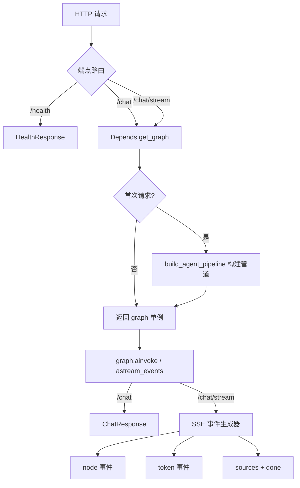

# API 服务层（API Service Layer）

## 1. 模块定位与设计动机

API 服务层（`src/api/`）是 RAGForge 的**唯一对外边界**，将 LangGraph 8 节点状态机封装为 HTTP 接口。其核心设计动机：

> Agent 状态机的构建成本极高（解析文档 → 切分 → 嵌入 → 组装图），必须惰性初始化并复用单例；同时需要同时支持同步请求和 SSE 流式两种交互模式。

这决定了模块的三个架构支柱：**应用工厂**、**惰性单例注入**、**SSE 事件模型**。

## 2. 架构与类设计

### 2.1 应用工厂 — create_app()

```python
def create_app() -> FastAPI
def get_app() -> FastAPI        # 模块级单例入口
def _configure_langsmith() -> None  # 环境变量零代码追踪
```

`create_app()` 构建 FastAPI 实例并 `include_router(router)`。LangSmith 追踪通过 `_configure_langsmith()` 设置环境变量（`LANGCHAIN_TRACING_V2`、`LANGCHAIN_API_KEY`），LangChain 运行时自动读取——零代码侵入。`get_app()` 提供模块级单例，供 uvicorn `--factory` 引用。

### 2.2 路由 — 3 端点

```python
GET  /health                         → HealthResponse
POST /chat         (async)           → ChatResponse
POST /chat/stream  (async + SSE)     → EventSourceResponse
```

| 端点 | 调用方式 | 用途 |
|------|----------|------|
| `/health` | 同步 | 健康检查，返回 `status` + `version` |
| `/chat` | `graph.ainvoke()` | 完整执行状态机后返回结构化响应（answer + sources + trace + metrics） |
| `/chat/stream` | `graph.astream_events(v2)` | SSE 流式，逐 token + 节点事件推送 |

**关键设计取舍**：`/chat` 使用 `ainvoke` 而非 `invoke`，避免阻塞 FastAPI 的事件循环。`/chat/stream` 使用 `astream_events(version="v2")` 而非 `astream()`——后者只返回节点级状态快照，无法捕获 `on_chat_model_stream` 事件，无法实现真正的逐 token 推送。

### 2.3 依赖注入 — get_graph()

```python
def get_graph() -> CompiledGraph  # FastAPI Depends 注入
```

Agent graph 构建成本极高（解析文档 → 切分 → 嵌入 → 构建向量索引 → 组装状态机），采用**惰性初始化 + double-check locking**：

```python
_graph_lock = threading.Lock()
_graph = None

def get_graph():
    global _graph
    if _graph is None:                    # 第一次检查（无锁，快速路径）
        with _graph_lock:
            if _graph is None:            # 第二次检查（持锁，防竞态）
                from src.pipeline import build_agent_pipeline  # 延迟导入
                _graph = build_agent_pipeline()
    return _graph
```

**延迟导入**（`from src.pipeline import ...` 放在函数体内）确保模块加载时不触发重型管道构建。FastAPI 每次请求调用此函数，实际只在首次构建，后续直接返回单例。

### 2.4 Pydantic Schemas — 接口合约

```python
class ChatRequest(BaseModel):       # query: str, session_id: str | None
class ChatResponse(BaseModel):      # answer + sources + agent_trace + metrics + session_id
class SourceDoc(BaseModel):         # content + source + score
class ResponseMetrics(BaseModel):   # retrieval_latency_ms + e2e_latency_ms + token_usage
class HealthResponse(BaseModel):    # status + version
```

`ChatResponse.agent_trace` 承载 Agent 状态机 `messages` 决策轨迹日志（由 `Annotated[list[str], add]` 在各节点自动追加），供前端展示 Agent 思考过程。

## 3. SSE 事件模型

`/chat/stream` 端点通过 `graph.astream_events(version="v2")` 捕获 4 种事件：

| 事件类型 | 触发条件 | data 格式 | 说明 |
|----------|----------|-----------|------|
| `node` | `on_chain_end` 且 name ∈ 8 个业务节点 | `{"node": "analyze"}` | Agent 节点执行完成 |
| `token` | `on_chat_model_stream` | `{"text": "<token>"}` | LLM 逐 token 生成（仅 generate 节点） |
| `sources` | 流结束后推送 | `[SourceDoc...]` | 检索来源文档 |
| `done` | 流结束 | `{"session_id": "...", "e2e_latency_ms": ...}` | 流终止信号 |

**节点过滤**：`_AGENT_NODES` 集合过滤 `on_chain_end`，忽略 LangGraph 内部链路噪声。通过监听 `name == "LangGraph"` 的 `on_chain_end` 获取根链路 final_state，用于流结束后提取来源文档。

---

## 4. 数据流



---

## 5. 设计模式

| 模式 | 体现 | 设计意图 |
|------|------|----------|
| **应用工厂** | `create_app()` 构建 FastAPI 实例 | 应用构建可测试、可重复，与运行时解耦 |
| **依赖注入** | `Depends(get_graph)` | 路由函数不直接构造依赖，由框架管理生命周期 |
| **惰性单例** | double-check locking + 延迟导入 | 首次请求才构建重型管道，启动延迟从 ~10s 降至 ~0s |
| **观察者（SSE）** | `astream_events` 异步事件迭代 | 将状态机的内部执行过程转化为事件流，前端可实时消费 |

**关键决策**：`MetricsCollector` 是进程级单例，但每次请求调用 `reset()` 实现请求级指标隔离——e2e_latency、token_usage 独立统计，不互相污染。

---

## 6. 错误处理

```
/chat 端点 ────── graph.ainvoke 异常 → FastAPI 默认 500 + 异常详情
                   │
/chat/stream ──── event_generator 内部异常 → catch + yield {"event":"error"} → SSE 优雅终止
                   │
get_graph ──────── 构建失败 → 异常冒泡到首个请求，返回 500（graph 不会缓存，下次重试）
```

SSE 端点的异常被 `except Exception` 捕获后转化为 `error` 事件推送给客户端，生成器自然终止，连接正常关闭——不会导致连接挂起。

---

## 7. 配置项

| 配置键 | 默认值 | 说明 |
|--------|--------|------|
| `api_host` | `0.0.0.0` | FastAPI 监听地址 |
| `api_port` | `8000` | FastAPI 监听端口 |
| `langsmith_tracing` | `false` | 是否启用 LangSmith 追踪 |
| `langsmith_api_key` | `""` | LangSmith API Key |
| `langsmith_project` | `ragforge` | LangSmith 项目名 |

启动命令：`uvicorn src.api.app:get_app --host 0.0.0.0 --port 8000 --factory`