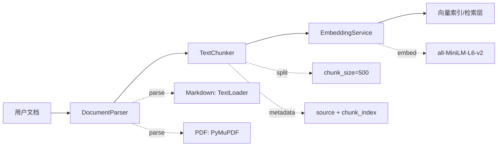

# 文档处理层（Ingestion）

## 模块职责

文档处理层负责将原始文档转换为可检索的向量表示，为检索层提供高质量的 Document 列表。核心流程：**文档解析 → 文本切分 → 向量化**。

## 类设计

### DocumentParser：策略模式解析器

根据文件后缀自动选择解析策略，支持 Markdown 和 PDF 两种格式。

```python
class DocumentParser:
    SUPPORTED_EXTENSIONS = {".md", ".pdf"}
    
    def parse(self, file_path: Path) -> list[Document]:
        """解析单个文件，根据后缀分发到对应解析器。"""
        
    def parse_directory(self, dir_path: Path, glob_pattern: str = "**/*") -> list[Document]:
        """批量解析目录下所有支持格式的文件。"""
```

**策略分发**：
- `.md` → `TextLoader`（LangChain 内置）
- `.pdf` → `PyMuPDF/fitz`（逐页提取，metadata 含 page_number）

### TextChunker：递归语义切分器

封装 `RecursiveCharacterTextSplitter`，切分后为每个 chunk 的 metadata 追加 `chunk_index`，保留原始 `source` 等元数据。

```python
class TextChunker:
    def __init__(self, chunk_size: int | None = None, chunk_overlap: int | None = None):
        """参数为空时从 settings 读取默认值。"""
        
    def split(self, documents: list[Document]) -> list[Document]:
        """切分文档列表，metadata 包含 source + chunk_index。"""
```

**分隔符优先级**：`["\n\n", "\n", "。", "！", "？", ".", "!", "?", " "]`

### EmbeddingService：线程安全单例

封装 `HuggingFaceEmbeddings`，模型加载成本高（首次约 1-2 秒），全局共享避免重复加载。

```python
class EmbeddingService:
    _instance: "EmbeddingService | None" = None
    _lock = threading.Lock()
    
    def __new__(cls, model_name: str | None = None):
        """线程安全单例，__new__ 内完成模型加载。"""
        
    def embed_documents(self, texts: list[str]) -> list[list[float]]:
        """批量生成文档向量。"""
        
    def embed_query(self, text: str) -> list[float]:
        """生成单条查询向量。"""
        
    @property
    def embedding_function(self) -> HuggingFaceEmbeddings:
        """暴露底层实例，供 ChromaDB 直接使用。"""
```

## 数据流图



## 设计模式

### 策略模式（Parser）

`DocumentParser.parse()` 根据文件后缀（`.md` / `.pdf`）分发到不同的解析实现：
- `_parse_markdown()`：使用 LangChain TextLoader，metadata 补充 `file_type="markdown"`
- `_parse_pdf()`：使用 PyMuPDF 逐页提取，metadata 含 `page_number`（1-based）

**扩展性**：新增格式只需在 `SUPPORTED_EXTENSIONS` 添加后缀，并实现对应的 `_parse_xxx()` 方法。

### 单例模式（Embedder）

`EmbeddingService` 采用 `__new__` + `threading.Lock` 实现线程安全单例：
- **动机**：模型加载耗时（1-2 秒），内存占用高（约 80MB）
- **实现**：`_lock` 保护下检查 `_instance`，首次创建后全局复用
- **暴露接口**：`embedding_function` 属性供 ChromaDB 直接注入

## 错误处理

### parse_directory：单文件异常隔离

批量解析时，单个文件的异常不会影响其他文件的处理：

```python
for file_path in sorted(dir_path.glob(glob_pattern)):
    if file_path.is_file() and file_path.suffix.lower() in self.SUPPORTED_EXTENSIONS:
        try:
            docs = self.parse(file_path)
            all_docs.extend(docs)
        except Exception as e:
            logger.error(f"[parser] 解析失败 {file_path}: {e}")
```

**设计原则**：日志记录错误详情，继续处理后续文件，确保整体流程不因单点失败中断。

## 配置项

| 配置项 | 默认值 | 说明 |
|--------|--------|------|
| `chunk_size` | 500 | 切分后的最大字符数 |
| `chunk_overlap` | 50 | 相邻 chunk 的重叠字符数 |
| `embedding_model` | all-MiniLM-L6-v2 | HuggingFace Embedding 模型 |

配置通过 `pydantic-settings` 从 `.env` 文件和环境变量读取，全局单例 `settings` 供各模块使用。
