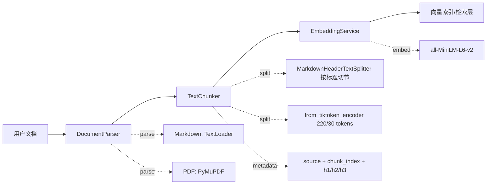

# 文档处理层（Ingestion）

## 模块职责

文档处理层负责将原始文档转换为可检索的向量表示，为检索层提供高质量的 Document 列表。核心流程：**文档解析 → 按标题切节 + token 预算切分 → 向量化**。

## 类设计

### DocumentParser：策略模式解析器

根据文件后缀自动选择解析策略，支持 Markdown 和 PDF 两种格式。

```python
class DocumentParser:
    SUPPORTED_EXTENSIONS = {".md", ".pdf"}

    def parse(self, file_path: Path) -> list[Document]:
        """解析单个文件，根据后缀分发到对应解析器。"""

    def parse_directory(self, dir_path: Path, glob_pattern: str = "**/*") -> list[Document]:
        """批量解析目录下所有支持格式的文件。"""
```

**策略分发**：
- `.md` → `TextLoader`（LangChain 内置）
- `.pdf` → `PyMuPDF/fitz`（逐页提取，metadata 含 page_number）

### TextChunker：token 预算切分 + 标题上下文

两段式切分：先经 `MarkdownHeaderTextSplitter` 按标题切节，再用 `RecursiveCharacterTextSplitter.from_tiktoken_encoder`（cl100k_base）按 **token** 预算切块。每个 chunk：

- metadata 携带 `h1/h2/h3` 标题层级 + `chunk_index`（按 source 连续编号，供向量库确定性 ID 使用）
- 正文前缀拼入标题路径（如 `机器学习 FAQ > 过拟合`），使标题词可被向量与 BM25 同时命中
- 切分**确定性**：同语料两次切分结果逐字节一致（向量库确定性 ID 的前提）

```python
class TextChunker:
    def __init__(self, chunk_size: int | None = None, chunk_overlap: int | None = None):
        """参数单位为 token（cl100k 估算），空时读 settings。"""

    def split(self, documents: list[Document]) -> list[Document]:
        """按标题切节 → 按 token 切块 → 注入标题前缀与 metadata。"""
```

**为什么按 token 而非字符**：embedding 模型的编码窗口有限（all-MiniLM-L6-v2 为 256 token，中文约 1 字 1 token）。按字符切 500 字符的中文长块，后半段会被编码器**静默截断**——约一半内容从未进入向量。220 token 预留了安全余量（标题前缀约占 10~20 token）。

### EmbeddingService：线程安全单例

封装 `HuggingFaceEmbeddings`，模型加载成本高（首次约 1-2 秒），全局共享避免重复加载。

```python
class EmbeddingService:
    _instance: "EmbeddingService | None" = None
    _lock = threading.Lock()

    def __new__(cls, model_name: str | None = None):
        """线程安全单例，__new__ 内完成模型加载；
        model_name 与已加载实例不一致时 raise（配置错误不再静默吞掉）。"""

    def embed_documents(self, texts: list[str]) -> list[list[float]]:
        """批量生成文档向量。"""

    def embed_query(self, text: str) -> list[float]:
        """生成单条查询向量。"""

    @property
    def embedding_function(self) -> HuggingFaceEmbeddings:
        """暴露底层实例，供 ChromaDB 直接使用。"""
```

## 数据流图



## 设计模式

### 策略模式（Parser）

`DocumentParser.parse()` 根据文件后缀（`.md` / `.pdf`）分发到不同的解析实现：
- `_parse_markdown()`：使用 LangChain TextLoader，metadata 补充 `file_type="markdown"`
- `_parse_pdf()`：使用 PyMuPDF 逐页提取，metadata 含 `page_number`（1-based）

**扩展性**：新增格式只需在 `SUPPORTED_EXTENSIONS` 添加后缀，并实现对应的 `_parse_xxx()` 方法。

### 单例模式（Embedder）

`EmbeddingService` 采用 `__new__` + `threading.Lock` 实现线程安全单例：
- **动机**：模型加载耗时（1-2 秒），内存占用高（约 80MB）
- **实现**：`_lock` 保护下检查 `_instance`，首次创建后全局复用；传入不同 `model_name` 直接报错
- **暴露接口**：`embedding_function` 属性供 ChromaDB 直接注入

## 错误处理

### parse_directory：单文件异常隔离

批量解析时，单个文件的异常不会影响其他文件的处理（loguru 记录错误详情，继续处理后续文件）。

## 配置项

| 配置项 | 默认值 | 说明 |
|--------|--------|------|
| `chunk_size` | 220 | 单个 chunk 的最大 token 数（cl100k 估算，需小于 embedding 窗口） |
| `chunk_overlap` | 30 | 相邻 chunk 的重叠 token 数（必须小于 chunk_size） |
| `embedding_model` | all-MiniLM-L6-v2 | HuggingFace Embedding 模型 |
| `embedding_device` | cpu | 推理设备（cpu / cuda） |
| `embedding_batch_size` | 32 | 批量编码大小 |

配置通过 `pydantic-settings` 从 `.env` 文件和环境变量读取，全局单例 `settings` 供各模块使用；`chunk_overlap < chunk_size` 由 model_validator 在启动时校验。
