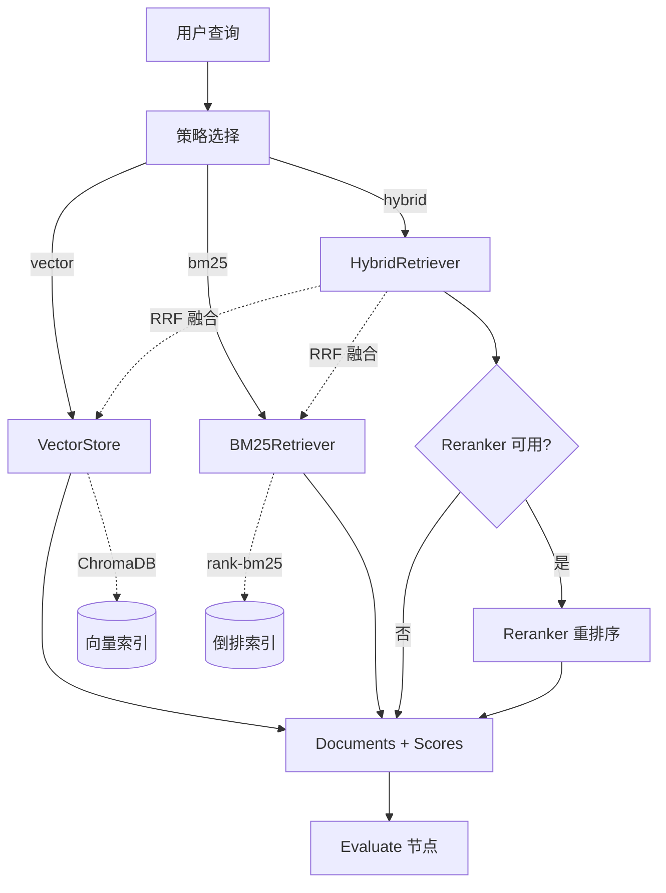

# 检索层（Retrieval）

## 模块职责

检索层提供 4 种检索策略（向量检索 / BM25 关键词检索 / 混合 RRF 融合 / 重排序），所有检索器实现统一的鸭子类型接口，无需继承基类。

## 统一接口

所有检索器遵循相同的签名约定：

```python
build_index(documents: list[Document]) -> None
search(query: str, k: int | None = None) -> list[Document]
search_with_scores(query: str, k: int | None = None) -> tuple[list[Document], list[float]]
```

**设计原则**：鸭子类型（Duck Typing），无需抽象基类，只要实现这三个方法即可被 Agent 层调用。

## 类设计

### VectorStore：ChromaDB 封装

封装 `langchain-chroma` 的相似度检索，支持持久化加载。

```python
class VectorStore:
    def __init__(self, embedding_service: EmbeddingService) -> None:
        """注入 Embedding 服务。"""
        
    def build_index(self, documents: list[Document]) -> None:
        """从文档列表构建向量索引（写入持久化目录）。"""
        
    def search_with_scores(self, query: str, k: int | None = None) -> tuple[list[Document], list[float]]:
        """返回 relevance score ∈ [0, 1]。"""
        
    @classmethod
    def load_or_build(cls, documents: list[Document], embedding_service: EmbeddingService) -> "VectorStore":
        """持久化加载：目录存在且非空则复用，否则重新构建。"""
```

**持久化策略**：`load_or_build()` 检查 `chroma_db/` 目录，非空则直接加载，避免重复索引。

### BM25Retriever：关键词检索

基于 `rank-bm25` + 中文分词（jieba 优先，regex fallback）。

```python
class BM25Retriever:
    def __init__(self) -> None:
        """初始化空索引。"""
        
    def build_index(self, documents: list[Document]) -> None:
        """构建 BM25 倒排索引。"""
        
    @staticmethod
    def _top_k_indices(scores: list[float], k: int) -> list[int]:
        """按分数降序取前 k 个索引。"""
```

**分词器**：`_tokenize()` 优先使用 `jieba.lcut()`，未安装时 fallback 到正则（中文按单字、英文按连续字母）。

### HybridRetriever：RRF 融合

Reciprocal Rank Fusion 融合向量 + BM25，无需归一化两路不同尺度的分数。

```python
class HybridRetriever:
    def __init__(self, vector_store: VectorStore, bm25: BM25Retriever, rrf_k: int | None = None) -> None:
        """注入底层检索器，rrf_k 默认 60。"""
        
    def search_with_scores(self, query: str, k: int | None = None) -> tuple[list[Document], list[float]]:
        """RRF 融合：score(d) = Σ_i 1/(rrf_k + rank_i(d))。"""
        
    @staticmethod
    def _doc_key(doc: Document) -> str:
        """去重键：内容前 80 字符。"""
```

**RRF 公式**：
\[
\text{score}(d) = \sum_{i} \frac{1}{k + \text{rank}_i(d)}
\]

其中 \(k=60\) 为平滑常数，避免 top-1 过度主导。每路各取 top-2k 候选，融合后按 RRF 分数取 top-k。

### Reranker：CrossEncoder 重排序

懒加载单例 + 优雅降级，模型约 560MB，下载可能失败。

```python
class Reranker:
    _instance: "Reranker | None" = None
    _lock = threading.Lock()
    
    def __new__(cls, model_name: str | None = None) -> "Reranker":
        """懒加载单例，__new__ 内不加载模型。"""
        
    def _ensure_loaded(self) -> None:
        """首次调用时尝试加载，失败后不再重试。"""
        
    def is_available(self) -> bool:
        """查询模型是否可用。"""
        
    def rerank(self, query: str, documents: list[Document], top_n: int | None = None) -> list[Document]:
        """CrossEncoder 对 (query, doc) pair 打分，按分数降序重排。"""
```

**优雅降级**：
- 加载失败 → `_model=None` + `logger.warning`
- `rerank()` 不可用时 → 直接返回原列表前 `top_n`
- 推理失败 → 捕获异常，降级为原顺序截断

## 数据流图



## 设计模式

### 鸭子类型（统一接口）

所有检索器实现 `build_index` / `search` / `search_with_scores` 三个方法，无需继承抽象基类。Agent 层通过 `retrieval_strategy` 字段动态选择检索器，只要接口一致即可替换。

**优势**：
- 松耦合：新增检索器无需修改基类
- 易测试：Mock 对象只需实现三个方法
- 运行时切换：`retrieve_node` 根据策略字段动态分发

### 优雅降级（Reranker）

`Reranker` 是"锦上添花"的增强组件，不可用时系统仍能正常工作：

```python
def _ensure_loaded(self) -> None:
    if self._load_attempted:
        return
    self._load_attempted = True
    try:
        from sentence_transformers import CrossEncoder
        self._model = CrossEncoder(self._model_name)
    except Exception as e:
        logger.warning(f"[reranker] 模型加载失败，已降级：{e}")
        self._model = None
```

**设计哲学**：核心功能（向量/BM25/混合）必须可用，增强功能（重排序）失败时透明降级。

### 懒加载单例（Reranker）

`Reranker` 采用懒加载策略，仅在首次调用 `is_available()` 或 `rerank()` 时尝试加载模型：
- **动机**：模型体积大（560MB），启动时加载会拖慢冷启动
- **实现**：`_ensure_loaded()` 检查 `_load_attempted` 标志，失败后不重试
- **线程安全**：`_lock` 保护单例创建

## 配置项

| 配置项 | 默认值 | 说明 |
|--------|--------|------|
| `retrieval_k` | 3 | 检索返回的文档数 |
| `rrf_k` | 60 | RRF 融合常数（标准值 60） |
| `reranker_model` | BAAI/bge-reranker-v2-m3 | CrossEncoder 重排序模型 |
| `reranker_top_n` | 5 | 重排序后保留的文档数 |

配置通过 `pydantic-settings` 从 `.env` 文件和环境变量读取，全局单例 `settings` 供各模块使用。
